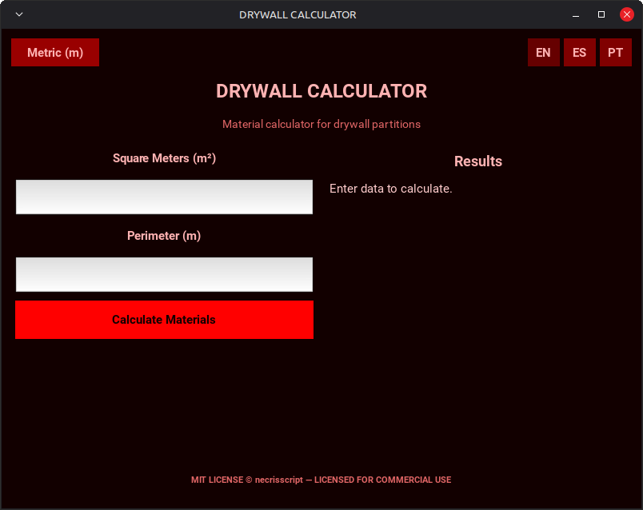

# Calculadora de Placas de Yeso

Una aplicación de escritorio que permite calcular apróximadamente los materiales necesarios para construir tabiques de placas de yeso, usando parámetros de superficie y perímetro.



## 🚀 Funcionalidades

* Soporte para dos sistemas de unidades: métrico e imperial.
* Interfaz multilingüe: inglés, español y portugués.
* Lógica inteligente para calcular uniones en altura cuando supera los 2,60 m.
* Desglose completo de materiales: soleras, montantes, placas, anclajes, tornillos T1/T2, cinta y masilla.
* Distribución en formato AppImage para Linux.

## 📦 Instalación

### AppImage

Descarga la última versión de la AppImage desde la página de [Releases](https://github.com/necrisscript/drywall-calculator/releases).

Dale permisos de ejecución:

```bash
chmod +x Drywall_Calculator-x86_64.AppImage
```

Ejecuta la aplicación:

```bash
./Drywall_Calculator-x86_64.AppImage
```

## 🛠️ Desarrollo

Clona el repositorio:

```bash
git clone https://github.com/necrisscript/drywall-calculator.git
cd drywall-calculator
```

Crea y activa un entorno virtual:

```bash
python3 -m venv .venv
source .venv/bin/activate
```

Instala las dependencias:

```bash
pip install -r requirements.txt
```

Ejecuta la aplicación:

```bash
python main.py
```

## 🔨 Compilación

El proyecto utiliza PyInstaller para crear el ejecutable de Linux y linuxdeploy para empaquetarlo como una AppImage.

Genera el ejecutable:

```bash
pyinstaller --clean drywall_calculator.spec
```

El ejecutable se generará en:

```bash
dist/drywall-calculator
```

Después, puedes generar la AppImage resultante usando linuxdeploy.

## ⚠️ Nota

Este proyecto fue creado principalmente para experimentar, aprender y pasar un buen rato programando con *vibe coding*. Es funcional, pero no pretende ser una solución profesional ni estar listo para producción. Úsalo, modifícalo y rompe cosas bajo tu propia responsabilidad.


## 📄 Licencia

Este proyecto está distribuido bajo la licencia MIT. Consulta el archivo `LICENSE` para más información.
